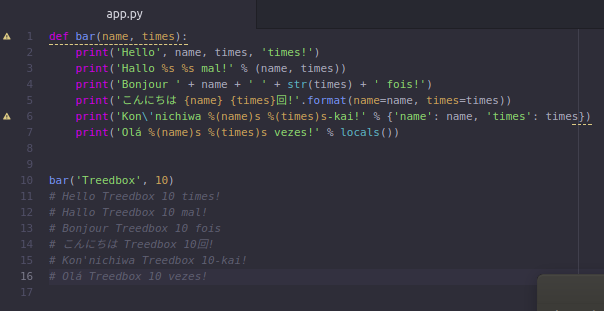

# Python 3 Basics Tutorial Exercises

> Exercises from Python 3 Basics Tutorial Series using Python 3.8 and 3.7

## Description
Exercises based on all video lessons (01-68) on **Python 3 Basics Tutorial Series** of [Harrison Kinsley @sentdex](https://twitter.com/sentdex) at YouTube:

https://www.youtube.com/watch?v=oVp1vrfL_w4&list=PLQVvvaa0QuDe8XSftW-RAxdo6OmaeL85M&index=1
[](https://www.youtube.com/watch?v=oVp1vrfL_w4&list=PLQVvvaa0QuDe8XSftW-RAxdo6OmaeL85M&index=1)

## Install / How to Use
To use this files you need have [Python 3+](https://www.python.org/downloads/) in your machine. Open a **Terminal** and type:
```
python /path/to/file.py
```
## Screenshots
MatPlotlib:


Concatenate examples:



Port scan:


## Tested on
* OS: Ubuntu 18.04.1 LTS bionic
* **Python 3.8-dev** (3.8.0a0) pip 18.0 (Most of the codes)
* **Python 3.7** pip 10.0.1 and pip 18.0
* IDE: Atom
* Device: Desktop

## Meta
Full Stack Developer: [Jonimar Marques Policarpo](http://linkedin.com/treedbox 'LinkEdin')

Twitter: [@treedbox](http://twitter.com/treedbox)

E-mail: [treedbox@gmail.com](mailto:treedbox@gmail.com)

Site: [treedbox](http://treedbox.com)

## License
[MIT](LICENSE.md) © [TreedBox](https://github.com/treedbox)

[https://github.com/treedbox/python-3-basic-exercises](https://github.com/treedbox/python-3-basic-exercises)
